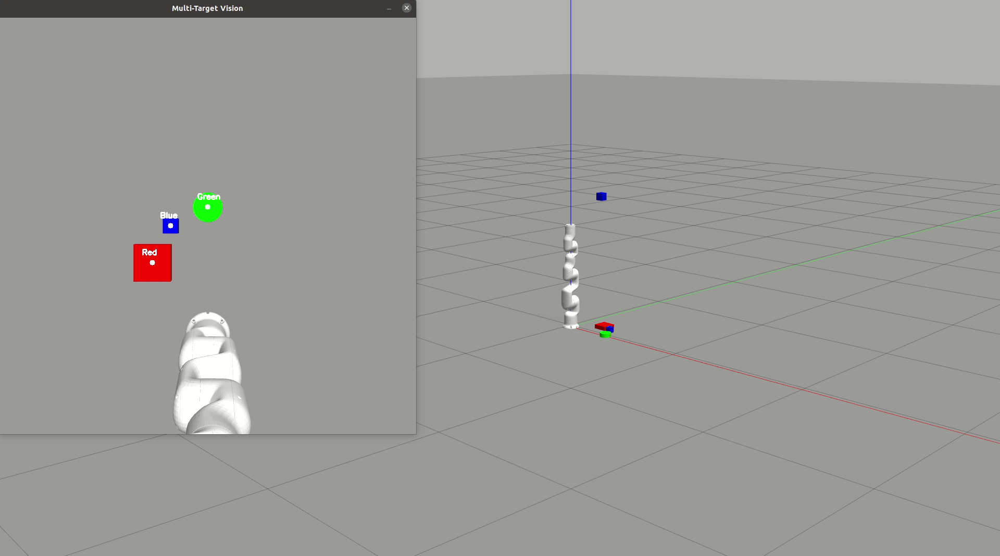

# JAKA Minicobo Vision Pick & Stacking 🤖👁️



基于 ROS Noetic 与 Gazebo 的手眼协同视觉抓取与高精物理堆叠仿真项目。本项目提供了一个高度稳定的物理仿真环境，能够无缝对接具身智能 (Embodied AI) 的研究需求，特别适用于生成 VLA (Vision-Language-Action) 模型所需的高精度模仿学习数据集。

## 📌 仓库与命名说明
**注意**：本开源仓库在 GitHub 上的名称为 `jaka_vision_stacking_ros`，但其内部包含的 ROS 核心功能包名称为 `jaka_vision_pick`。在终端执行 `roslaunch` 或 `rosrun` 指令时，请统一使用 `jaka_vision_pick`。建议在克隆时直接将文件夹重命名以保持一致（详见下文安装步骤）。

## 🌟 项目简介
本项目使用节卡 (JAKA) Minicobo 协作机械臂，结合顶置 RGB 相机，实现了从单目标颜色识别抓取，到多目标（红、绿、蓝）动态生成、识别及高稳定物理堆叠的端到端仿真。

**✨ 核心方法与特性：**
* **动态环境生成**：通过调用 Gazebo 服务，在运行时动态投放不同几何形状与颜色的 URDF 模型。
* **视觉与坐标转换**：基于 OpenCV 提取 HSV 色块，实现像素坐标系到世界坐标系的精确转换，可直接输出供学术论文使用的高质量视觉呈现画面。
* **高频运动学吸附方法**：摒弃易崩溃的物理碰撞模拟，采用 **125Hz** 高频 ROS 定时器同步模型状态，实现平滑、无延迟的“虚拟吸盘”抓取。
* **稳定堆叠物理调优**：针对 Gazebo 物理引擎调优极高摩擦系数（$\mu_1, \mu_2 = 100$）与接触防抖参数，彻底解决多层仿真堆叠滑落难题。
* 
## 📂 核心代码结构解析
本项目遵循标准 ROS 功能包结构，模块化设计方便开发者进行二次开发。目录与核心文件功能说明如下：
```text
jaka_vision_pick/
├── CMakeLists.txt              # ROS 编译配置文件
├── package.xml                 # 功能包依赖声明文件
├── demo.gif                    # 演示动图
├── launch/                     # ROS 启动文件目录
│   ├── vision_pick.launch       # 模式一：启动单目标抓取仿真环境 (包含机械臂、相机与单个红色物块)
│   └── multi_vision_pick.launch # 模式二：启动多目标堆叠仿真环境 (包含机械臂与相机，物块等待脚本动态生成)
├── scripts/                    # Python 核心逻辑代码
│   ├── vision_detector.py       # [模式一] 视觉节点：OpenCV 识别红色物块并发布世界坐标
│   ├── control_node.py          # [模式一] 控制节点：MoveIt 运动规划与单物块虚拟吸附抓取逻辑
│   ├── spawn_objects.py         # [模式二] 环境节点：调用 Gazebo 服务，动态生成带有高摩擦力物理属性的三色物块
│   ├── multi_vision.py          # [模式二] 视觉节点：并行识别红/绿/蓝多目标，发布至独立的坐标话题
│   └── multi_control.py         # [模式二] 控制节点：125Hz 高频运动学吸附，多目标精确高度累加与自动堆叠控制
└── urdf/                       # 机器人与环境模型文件
    ├── camera_and_box.xacro     # 顶置相机的 URDF 描述文件 (包含质量惯性、空间位姿与 gazebo_ros_camera 插件)
    └── target_block.urdf        # 模式一中红色目标物块的独立物理模型定义
```

## 🛠️ 依赖环境与前置准备
1. Ubuntu 20.04 + ROS Noetic (或 Ubuntu 18.04 + ROS Melodic)
2. MoveIt 1
3. Python 3.x 依赖：`opencv-python`, `cv_bridge`
4. **[核心依赖]** 节卡官方 ROS 驱动包：
   本项目的机械臂模型与基础配置依赖于 JAKA 官方库。请务必先下载并编译 JAKA 官方仓库：[https://github.com/JakaCobot/JAKA_ROS_Demo](https://github.com/JakaCobot/JAKA_ROS_Demo)

## 🚀 安装与编译

```bash
# 1. 进入你的 ROS 工作空间 src 目录 (假设工作空间为 jaka_robot_v2.2)
cd ~/jaka_robot_v2.2/src

# 2. 克隆本仓库 (克隆时直接命名为 jaka_vision_pick 解决命名冲突)
git clone https://github.com/AaronCRD/jaka_vision_stacking_ros.git jaka_vision_pick

# 3. 赋予所有 Python 脚本可执行权限
chmod +x jaka_vision_pick/scripts/*.py

# 4. 编译工作空间
cd ~/jaka_robot_v2.2
catkin_make

# 5. 刷新环境变量
source devel/setup.bash
```

## 🎮 详细操作步骤

### 模式一：基础单目标抓取 (Single Pick & Place)
此模式将生成一个固定的红色物块，机械臂视觉锁定后将其移动到左侧放置点。
请依次打开 **3 个独立终端**，并在每个终端中优先执行 `source ~/jaka_robot_v2.2/devel/setup.bash`：

**终端 1：启动仿真世界**
```bash
roslaunch jaka_vision_pick vision_pick.launch
```
> **预期**：Gazebo 和 RViz 启动，桌面中心出现红色物块。若 Gazebo 处于暂停状态，请点击左下角播放按钮。

**终端 2：启动视觉识别**
```bash
rosrun jaka_vision_pick vision_detector.py
```
> **预期**：弹出 OpenCV 画面窗口，红块中心出现绿色定位点。

**终端 3：执行运动控制**
```bash
rosrun jaka_vision_pick control_node.py
```
> **预期**：机械臂自动规划路径，完成抓取与放置动作。

---

### 模式二：多目标进阶堆叠 (Multi-Stacking)
此模式将动态投放三种不同颜色和形状的物体，机械臂将依次识别、抓取并搭建成塔。
请依次打开 **4 个独立终端**，并在每个终端中优先执行 `source ~/jaka_robot_v2.2/devel/setup.bash`：

**终端 1：启动空白仿真世界与顶置相机**
```bash
roslaunch jaka_vision_pick multi_vision_pick.launch
```
> **预期**：加载机械臂与半空中的蓝色顶置相机。

**终端 2：动态投放物块**
```bash
rosrun jaka_vision_pick spawn_objects.py
```
> **预期**：Gazebo 桌面瞬间掉落红色方块、绿色圆柱和蓝色方块。

**终端 3：启动多目标视觉追踪**
```bash
rosrun jaka_vision_pick multi_vision.py
```
> **预期**：弹出视觉窗口，三个物块分别被框选并打上对应名称标签。

**终端 4：执行 125Hz 高频堆叠控制**
```bash
rosrun jaka_vision_pick multi_control.py
```
> **预期**：机械臂按红->绿->蓝的顺序，精准完成物理堆叠。

## 📝 License
This project is licensed under the MIT License.
